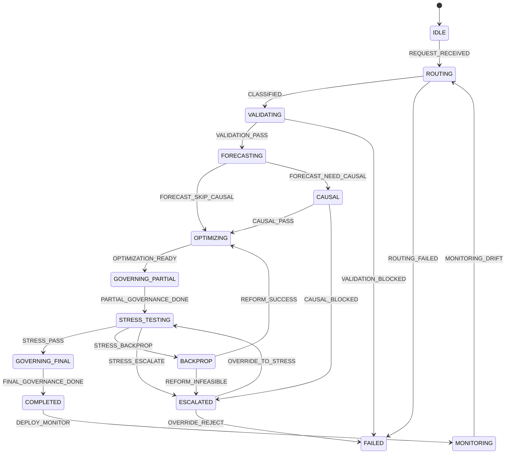

# Decision Resilience Engine (DRE)

**Un motor de decisiones que no miente sobre su estado: cada paso queda en una
bitácora append-only, reejecutarlo no duplica nada, y se retoma exactamente donde
quedó.**

> *A decision engine that doesn't lie about its own state: every transition lands in
> an append-only ledger, re-running is idempotent, and any run resumes from its last
> checkpoint. Ships with a quantitative backtesting lab (MAT) used as its measurement
> bench.*

[](https://github.com/emilianob-ux/decision-resilience-engine/actions/workflows/ci.yml)
[](https://www.python.org/downloads/)
[](LICENSE)
[](tests/)

**English:** [README.en.md](README.en.md) · **Auditoría honesta del repo:** [AUDIT.md](AUDIT.md)

---

## El problema

Un pipeline de decisión que corre por horas y se cae a la mitad deja tres preguntas
sin respuesta: *¿en qué estado quedó?*, *¿puedo reejecutarlo sin duplicar nada?* y
*¿puedo demostrar después por qué decidió lo que decidió?* La respuesta habitual son
logs sueltos y un `try/except` que reinicia desde cero.

**Este repo es mi respuesta a esas tres preguntas**, implementada en chico y con
tests que la verifican.

## Para quién

- **Ingenieros** que construyen orquestación de larga duración y necesitan
  reanudación y auditoría, no solo reintentos.
- **Quants / researchers** que quieran un banco de medición reproducible: el
  laboratorio MAT (futuros BTC/ETH) entra al motor como *measurement command*.
- **Quien evalúa mi trabajo:** este repo está para mostrar cómo separo contratos,
  estado y efectos; cómo elijo qué *no* construir; y cómo documento lo que falta.

## Qué hay hoy (MVP) y qué es aspiración

| | Hoy (implementado + testeado) | Roadmap / diseñado |
|---|---|---|
| **Orquestación** | FSM en tabla, 21 transiciones, 16 estados; transición no declarada ⇒ `FSMError` | Router por modo de ejecución (FAST/DEEP_AUDIT); hoy todo corre como `STANDARD` |
| **Governance** | SQLite: registro idempotente por `(run_id, data_hash)`, bitácora append-only encadenada, colisión ⇒ HTTP 409 tipado | Triggers que rechacen `UPDATE`/`DELETE` en la propia base; PostgreSQL |
| **Resiliencia** | Checkpoint por transición; `resume` devuelve el contexto **idéntico** campo por campo | TTL y limpieza automática de checkpoints |
| **Estado volátil** | `ContextStore` (ABC) + backends memoria y Redis (probado con `fakeredis`) | Redis real distribuido con locking |
| **API** | `GET /dre/health`, `POST /dre/simulate`, `POST /dre/resume` (FastAPI, 422/404/409 correctos) | Auth, rate limiting, gRPC |
| **Skills numéricos** | *lite* y honestos: forecasting KS-vs-normal, stress LP (HiGHS), drift PSI+Frobenius, overlap causal Tier-1, clasificador de override | KDE+FFT, copulas, programación estocástica en 2 etapas, DoWhy/CausalML |
| **Medición (MAT)** | Backtest compuesto BTC/ETH con funding, ventanas deslizantes y walk-forward (`--holdout-frac`) | Tests unitarios del runner (ver [AUDIT.md](AUDIT.md) P1-5) |

El mapa completo componente → archivo → test, y la lista explícita de lo que
**no** está implementado: [`docs/DRE_IMPLEMENTATION_STATUS.md`](docs/DRE_IMPLEMENTATION_STATUS.md).

## Demo de 60 segundos

```bash
git clone https://github.com/emilianob-ux/decision-resilience-engine
cd decision-resilience-engine
pip install -r requirements.txt -r requirements-dev.txt
bash scripts/demo_dre.sh
```

Un comando, ~3 segundos, sin segunda terminal. Levanta la API sobre un ledger
SQLite limpio y demuestra las tres propiedades del motor:

```
==> 3/5  POST /dre/resume  (reconstruye el contexto desde el ultimo checkpoint)
current_state = MONITORING

==> 4/5  Idempotencia: mismo run_id + mismo data_hash => el run NO se duplica
registry_write = already_existed (esperado: already_existed)

==> 5/5  Colision: mismo run_id + data_hash DISTINTO => HTTP 409 tipado
     HTTP 409
{
    "error": "RUN_ID_COLLISION",
    "data_hash_expected": "sha256:demo",
    "data_hash_received": "sha256:OTRO",
    "recovery": "Generate new run_id or verify input pipeline consistency"
}

==> Bitacora persistida (SQLite append-only)
     runs registrados = 1   eventos de auditoria = 18   checkpoints = 18
       IDLE               --REQUEST_RECEIVED        --> ROUTING
       ROUTING            --CLASSIFIED              --> VALIDATING
       VALIDATING         --VALIDATION_PASS         --> FORECASTING
       ...
       COMPLETED          --DEPLOY_MONITOR          --> MONITORING
```

*Dos envíos idénticos, una sola fila de registro, 18 eventos de bitácora, 409 en la
colisión. Eso es todo el argumento del repo, ejecutable.*

## Por qué esto muestra criterio de ingeniería

1. **Las invariantes están testeadas, no prometidas.**
   `tests/test_dre_invariants.py` no verifica que el camino feliz termine bien:
   verifica que la bitácora esté **encadenada** (el `state_after` de cada evento es
   el `state_before` del siguiente), que `resume` devuelva el contexto exacto
   (`model_dump` completo, no solo el estado), y que la FSM no tenga estados
   inalcanzables — validada como grafo, sin ejecutarla.

2. **La documentación es un contrato que CI hace cumplir.**
   El ICD dice espejar `dre/contracts/`; `tests/test_docs_contract.py` verifica que
   los snippets sean el archivo **verbatim** y falla si divergen. El mismo archivo
   guarda contra los dos errores de Mermaid que rompían los diagramas en GitHub y
   contra la regresión de imports que tenía la demo rota.

3. **Elijo qué no construir, y lo digo.**
   Los skills se llaman *lite* porque son proxies baratos: `forecasting` es un test
   KS contra una normal, no KDE con FFT. Está escrito así en el código
   (`kind: "univariate_gaussian_proxy"`), en el estado de implementación y en la
   auditoría. Prefiero un repo que dice "esto es un proxy" a uno que dice
   "inferencia causal" sobre 25 líneas.

> **Aviso:** software experimental de investigación. **No es asesoramiento
> financiero.** El componente MAT mide probabilidades sobre datos históricos o
> sintéticos; el rendimiento pasado no garantiza resultados futuros.

---

## La FSM que realmente corre

Estas son las 21 transiciones que hay en `dre/orchestrator/fsm.py`, no un diagrama
de diseño. En **negrita** el camino que ejecuta la demo.



Cada transición escribe **un** evento de auditoría y **un** checkpoint. El único
estado absorbente es `FAILED`: `COMPLETED` pasa a `MONITORING`, que puede volver a
`ROUTING` por drift. Las ramas `BACKPROP` y `ESCALATED` están declaradas y
testeadas en la tabla, pero **ningún recorrido implementado las recorre todavía**
(ver [AUDIT.md](AUDIT.md) P2-4).

---

## Los dos quickstarts

Este repo tiene **dos capas separadas**. No hace falta la segunda para evaluar la
primera.

### 1. DRE — el motor (empezá por acá)

```bash
pip install -r requirements.txt -r requirements-dev.txt

bash scripts/demo_dre.sh              # demo completa en un comando
# o, a mano:
python scripts/run_dre_api.py --db data/dre_governance.sqlite
```

```bash
curl -X POST http://127.0.0.1:8000/dre/simulate \
  -H "Content-Type: application/json" \
  -d '{"run_id":"opt_20260506_000100_v5.0","data_hash":"sha256:demo","rng_seed":7,"variant":"standard"}'

curl -X POST http://127.0.0.1:8000/dre/resume \
  -H "Content-Type: application/json" \
  -d '{"run_id":"opt_20260506_000100_v5.0"}'
```

| Endpoint | Qué hace | Errores tipados |
|---|---|---|
| `GET /dre/health` | Liveness | — |
| `POST /dre/simulate` | Recorre la FSM completa y persiste bitácora + checkpoints | `422` payload inválido · `409` `RUN_ID_COLLISION` |
| `POST /dre/resume` | Reconstruye el contexto desde el último checkpoint | `404` sin checkpoint para ese `run_id` |

El `run_id` sigue el patrón `^opt_\d{8}_\d{6}_v5\.0$` — es parte del contrato, no una
convención: un id malformado devuelve 422.

### 2. MAT — el laboratorio de medición (opcional)

Backtest compuesto BTC/ETH (futuros USDT) con funding, ventanas deslizantes y
walk-forward. **Es el banco de medición del motor, no el producto.**

```bash
python scripts/bootstrap_synthetic_candles_db.py     # dataset sintético, ~0.3 s
pytest tests/ -q                                     # 48 tests
python compound_optimize_runner.py --db data/synthetic_signal_tune.db --holdout-frac 0.2
```

Salida: JSON en stdout con `p_win_terminal`, `p_ruin`, `p_survive_medium` y el bloque
`walk_forward` (in-sample vs holdout y sus deltas). Optimización por rejilla:

```bash
python scripts/optimize_signal_grid.py --db data/synthetic_signal_tune.db \
  --preset smoke --skip-pairs --holdout-frac 0.2
```

El puente entre las dos capas es `dre/measurement/mat_runner.py`: invoca el runner
por subproceso y parsea su JSON (patrón *measurement command*). Hoy lo ejercita un
test; el pipeline DRE todavía no lo llama.

---

## Documentación

| Leé esto si… | Documento |
|---|---|
| Querés saber qué está implementado de verdad y qué no | [`docs/DRE_IMPLEMENTATION_STATUS.md`](docs/DRE_IMPLEMENTATION_STATUS.md) |
| Vas a tocar el código y necesitás los contratos exactos | [`docs/pdr/02_Interface_Contracts_ICD.md`](docs/pdr/02_Interface_Contracts_ICD.md) |
| Querés el diseño completo (**documento de diseño, no de estado**) | [`docs/DRE_TECHNICAL_ARCHITECTURE.md`](docs/DRE_TECHNICAL_ARCHITECTURE.md) |
| Querés ver cómo escribo requisitos antes de codear | [`docs/specs/`](docs/specs/) |
| Querés la crítica honesta de este mismo repo | [`AUDIT.md`](AUDIT.md) |
| Vas a correr el laboratorio MAT paso a paso | [`docs/tutorial_quickstart.md`](docs/tutorial_quickstart.md) |
| Necesitás el esquema de datos del runner | [`docs/DATASET.md`](docs/DATASET.md) |
| Índice completo | [`docs/README.md`](docs/README.md) |

---

## Por qué existe este repo

Trabajo sobre una convicción simple: **un sistema que no puede explicar cómo llegó a
su estado no es confiable, por más que acierte.** Por eso acá la gobernanza no es
una capa de logging encima del motor — es el motor: la FSM falla fuerte ante una
transición no declarada, el ledger es append-only, la idempotencia se define por
`(run_id, data_hash)` y no por timestamp, y el `resume` se testea comparando el
contexto completo, no solo el estado final.

Las decisiones de diseño que defiendo, en orden: **contratos explícitos** antes que
convenciones; **reproducibilidad** (seeds, dataset sintético, contratos de métricas
versionados) antes que resultados lindos; y **decir lo que falta** antes que inflar
lo que hay — por eso este repo tiene un [AUDIT.md](AUDIT.md) que lo critica.

Busco roles de **backend / plataforma / infraestructura de datos** donde la
corrección y la auditabilidad importen más que la velocidad de feature. Si estás
construyendo orquestación de larga duración, pipelines reanudables o sistemas con
requisitos de auditoría, escribime — y si encontrás un claim de este repo que no
se sostiene, abrí un issue: es la contribución que más valoro.

---

## Calidad

```bash
ruff check . && ruff format --check .   # lint + formato (ruff pineado exacto)
pytest tests/ -q                        # 48 tests
bash scripts/demo_dre.sh                # demo end-to-end
```

CI corre ambas cosas en Python 3.11 y 3.12, genera el dataset sintético, ejecuta el
smoke del runner MAT y valida los artefactos de build con `twine check --strict`.

## Instalación como paquete

La wheel incluye el motor `dre/` y los módulos MAT. La API HTTP es un extra:

```bash
pip install "git+https://github.com/emilianob-ux/decision-resilience-engine.git"          # motor
pip install "decision-resilience-engine[api] @ git+https://github.com/emilianob-ux/decision-resilience-engine.git"   # + FastAPI/uvicorn
```

Para evaluar el repo, **cloná**: la demo y los tests viven en el repositorio, no en
la wheel.

<sub><b>Nota sobre PyPI.</b> Este proyecto se publicó históricamente bajo el nombre
<code>sistema-optimizacion-mat</code> (última versión ahí: 0.2.0, solo módulos MAT).
El nombre nuevo <code>decision-resilience-engine</code> <b>todavía no está publicado
en PyPI</b>. El checklist para el primer upload está en
<a href="docs/PUBLISHING_PYPI.md"><code>docs/PUBLISHING_PYPI.md</code></a>.</sub>

## Licencia y seguridad

- Licencia: [MIT](LICENSE) · Reporte de vulnerabilidades: [SECURITY.md](SECURITY.md)
- Historial de cambios: [CHANGELOG.md](CHANGELOG.md)
