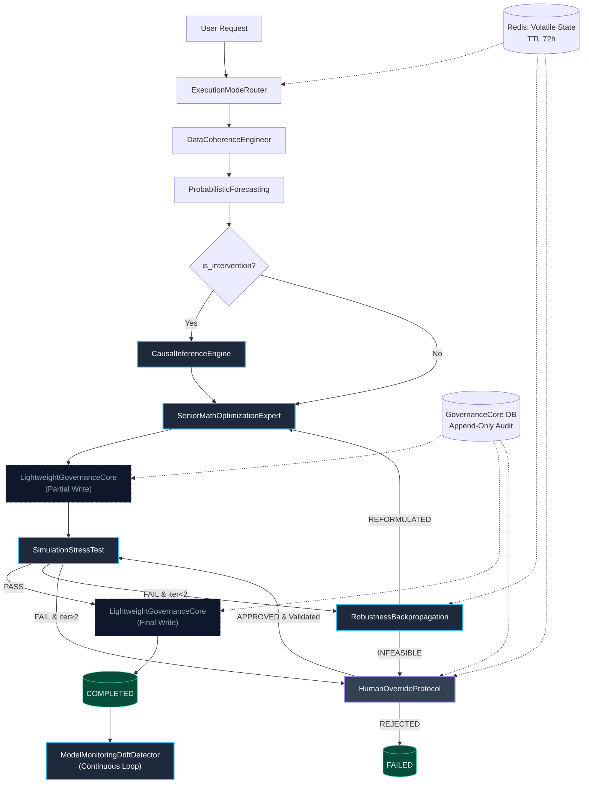
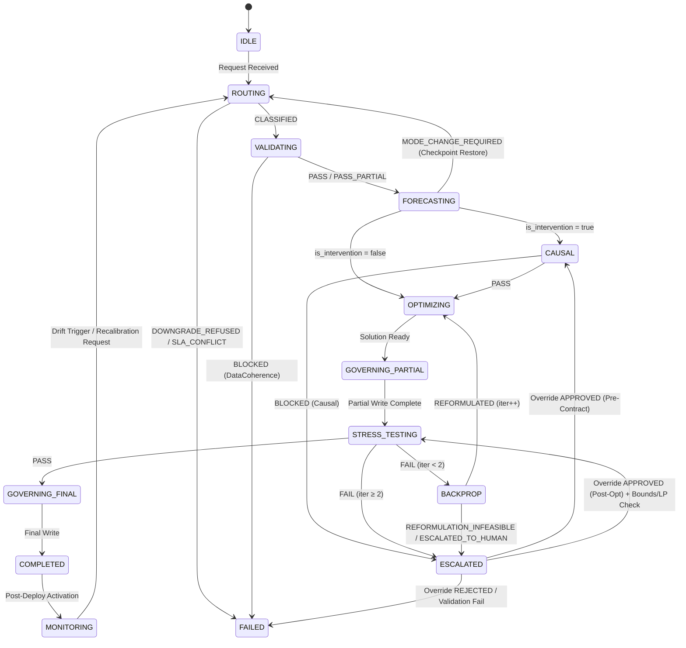

# Technical Architecture & Methodologies: Decision Resilience Engine

> **⚠️ This is a DESIGN document, not a status report.** It describes the target
> system. Most of what follows (KDE with FFT, copulas, two-stage stochastic
> programming, DoWhy, tamper-evident ledger, Redis TTL policy, the latency SLAs
> in §7) is **not implemented**. What actually runs today is a much smaller MVP:
> see [DRE_IMPLEMENTATION_STATUS.md](DRE_IMPLEMENTATION_STATUS.md) for the
> component-by-component map, and [`../AUDIT.md`](../AUDIT.md) for the honest gap
> analysis. The §5.2 FSM diagram is the one section that matches the code.
>
> **Document purpose:** Technical reference for architects, data scientists, and MLOps engineers.  
> **Scope:** Mathematical foundations, algorithmic pipelines, system design patterns, and compliance targets.  
> **Version:** 1.1 (aligned with ecosystem specs v1.5–v1.8)

---

## 1. Core Mathematical & Statistical Foundations

### 1.1 Probabilistic Forecasting (`ProbabilisticForecasting`)

- **Non-parametric estimation:** Kernel Density Estimation (KDE) with FFT acceleration `O(N log N)` for `N > 1000`.
- **Parametric fitting:** Distribution selection via domain priors + goodness-of-fit tests (Kolmogorov–Smirnov, Anderson–Darling). Supported families: `Normal`, `Log-Normal`, `Gamma`, `Beta`, `t-Student` (fat-tailed domains).
- **Bayesian updating:** Conjugate priors for low-data regimes (`N < 10`), yielding posterior credible intervals.
- **Dependence modeling:**
  - `N ≥ 30`: Gaussian/t-Student copulas preserving full correlation structure.
  - `N < 30`: Ledoit–Wolf covariance shrinkage with numerical stability checks. Fallback to independence + robust programming flag if PSD matrix fails.
- **Stationarity protocol:** Seasonal decomposition → drift evaluation → ADF/KPSS dual testing. Conflict resolution defaults to KPSS (conservative non-stationarity assumption).
- **Uncertainty metric:** `cv_effective = max(CV_list)`. Distinguishes `forecast_residuals` vs `historical_proxy` to prevent false precision.

### 1.2 Stress Simulation (`SimulationStressTest`)

- **Scenario generation:**
  - Historical tail events (p95/p99)
  - Copula-sampled multivariate shocks
  - Synthetic perturbations (Gaussian/Latin Hypercube)
- **Feasibility & degradation metrics:**
  - `infeasibility_rate = (INFEASIBLE ∪ TIMEOUT) / N_scenarios`
  - `min_slack_global = min(min_slack_i)` across all scenarios
  - `KPI_degradation_pct = (KPI_stress - KPI_base) / |KPI_base|`
- **Deterministic action mapping:** Priority-ordered fallback tree (`switch_to_stochastic` > `add_robustness_buffer` > `relax_soft_with_penalty`). Max 2 reformulation iterations.

---

## 2. Robust Optimization & Backpropagation (`RobustnessBackpropagation`)

### 2.1 Reformulation strategies

| Trigger | Mathematical transformation | Constraints |
|---------|----------------------------|-------------|
| `infeasibility_rate ∈ (5%, 15%]` or `min_slack < 0.02` | **Buffer in objective:** `min cᵀx + λ Σ(uncertainty_i \|x_i\|)`<br>**Buffer in RHS:** `b_j_new = b_j × (1 + max(\|slack_j\|, 0.05))` | HARD constraints immutable |
| `infeasibility_rate > 15%` or `compound_event_infeasible` | **Two-stage stochastic programming:**<br>`min cᵀx + Σ_s p_s Q(x, ξ_s)`<br>`s.t. Ax ≤ b, W y_s = h_s - T_s x` | Requires `ProbabilisticForecasting` output |
| Soft constraint violation only | **Penalty relaxation:** `penalty_j_new = penalty_j × (1 + (\|slack_j\|/b_j) × scale)` | Cap at `max_penalty_cap`; promote to HARD if breached |

### 2.2 Pre-solver validation

- **Bounds consistency:** `O(n)` check for `lb ≤ ub` and domain violations.
- **LP relaxation test:** Time-boxed (2s) linear relaxation solve. Returns `REFORMULATION_INFEASIBLE` on infeasibility/timeout to avoid expensive MIP/IP solver hangs.

---

## 3. Causal Inference & Intervention Modeling (`CausalInferenceEngine`)

### 3.1 Estimation hierarchy

| Level | Method | Use case | Compute |
|-------|--------|----------|---------|
| 1 | Policy-aware validator | FAST mode, quick gate | `<5s` |
| 2 | Diff-in-Diff / Synthetic Control / IV proxy | STANDARD, panel data available | `<60s` |
| 3 | DoWhy/CausalML + graphical model | DEEP_AUDIT, high impact | Batch |

### 3.2 Identification & validation

- **Overlap check:** Propensity score distribution overlap `≥ 0.6` required. Below threshold → `BLOCKED`.
- **ATE confidence:** `ATE_bounds` crossing zero in critical variables → `BLOCKED`.
- **Refutation tests (Level 3):**
  - Placebo treatment (expect `ATE ≈ 0`)
  - Random common cause injection
  - 80% data subset stability check
- **Heterogeneity:** CATE reporting; `CV_CATE > 0.5` triggers escalation to DEEP_AUDIT.

---

## 4. Continuous Monitoring & Drift Detection (`ModelMonitoringDriftDetector`)

### 4.1 Drift metrics

| Metric | Formula | Thresholds |
|--------|---------|--------------|
| **PSI** | `Σ (P_act - P_ref) × ln(P_act / P_ref)` | `<0.10`: INFO, `0.10–0.15`: EARLY, `>0.15`: WARN, `>0.25`: CRIT |
| **Frobenius norm** | `\|Σ_act - Σ_ref\|_F` | `<0.10`: STABLE, `>0.30`: REGIME CHANGE |
| **KPI degradation** | `(KPI_t - μ_KPI) / σ_KPI` | `< -2σ`: CRIT, `< -3σ`: EMERGENCY |
| **Duality gap z-score** | `(gap_t - μ_gap) / σ_gap` | `>2`: WARN, `>3`: CRIT (solver instability) |

### 4.2 Operational logic

- **Stateful sliding windows:** Incremental histogram updates for PSI `O(B)` per variable. Sherman–Morrison–Woodbury for correlation matrix updates.
- **Persistence rule:** `≥3` consecutive runs in critical band required for `CRITICAL`/`EMERGENCY` state (filters single-outlier noise).
- **Override multiplier:** Active `HumanOverrideProtocol` → `frequency × 3` without altering thresholds.

---

## 5. System Architecture & Engineering Patterns

### 5.1 Pipeline architecture & data flow



### 5.2 Orchestrator state machine (FSM)



---

## 6. Data Governance, Security & Auditability

### 6.1 Immutability & storage separation

```mermaid
flowchart LR
    subgraph Volatile_Layer ["Redis (Volatile State)"]
        direction LR
        Ctx[Execution Context] <--> Counters[Iteration Counters]
        Counters <--> Temp[TTL 72h Auto-Expiry]
    end

    subgraph Audit_Layer ["GovernanceCore (Immutable Ledger)"]
        direction LR
        Runs[("Runs: Append-Only")] --> Overrides[("Overrides: Indexed")]
        Overrides --> Checkpoints[("Checkpoints: TTL 24h")]
    end

    Input[Raw Input Data] -->|SHA-256| Hash[data_hash]
    Hash --> Volatile_Layer
    Volatile_Layer -->|On Transition| Audit_Layer
    Audit_Layer -->|Read Only| Orchestrator[Orchestrator FSM]

    classDef vol fill:#1e293b,stroke:#38bdf8,color:#f8fafc
    classDef imm fill:#064e3b,stroke:#34d399,color:#ecfdf5
    class Volatile_Layer vol
    class Audit_Layer imm
```



- **Write strategy:** `write_run` idempotent check on `(run_id + data_hash)`. Collision with differing hash → `FAIL`. Identical → `already_existed: true`.
- **Read strategy:** Orchestrator restores context from Redis on `ESCALATED` resume. GovernanceCore queried only for historical baselines, compliance reports, or checkpoint validation.
- **Tamper evidence:** Any `UPDATE/DELETE` attempt on run records is rejected and logged as an `AUDIT_VIOLATION` event.

### 6.2 Human-in-the-loop sandbox protocol

1. **Interception:** Override request captured at `Pre-Contract`, `Post-Optimization`, or `Post-Deploy`.
2. **Sandbox execution:** 50-iteration lightweight simulation using current model + override parameters.
3. **Impact assessment:**
   - `|ΔKPI| ≤ 5%` → Auto-approved + logged
   - `ΔKPI ∈ (-15%, -5%)` → Elevated approval required
   - `ΔKPI < -15%` → Hard rejection (cannot be overridden)
4. **Time-bound deployment:** `expiry_utc` enforced. Auto-rollback on threshold breach or TTL expiry.
5. **Audit closure:** All attempts (approved/rejected/rolled-back) appended to `override_ref` log with `run_id_hash` linkage.

---

## 7. Computational Complexity & Performance Guarantees

| Component | Worst-case complexity | Optimization strategy | SLA target |
|-----------|----------------------|----------------------|------------|
| ProbabilisticForecasting | `O(N²)` → `O(N log N)` (FFT) | Windowed KDE, pre-computed bins | `<2s` (FAST) |
| SimulationStressTest | `O(N_scenarios × T_solver)` | Parallel scenario dispatch, model reuse | `<30s` (STD) |
| CausalInferenceEngine | `O(p²n)` (propensity) | Cached covariance, vectorized ops | `<60s` |
| DriftDetector | `O(B × V)` per run | Incremental updates, streaming buffers | `<1s` |
| Orchestrator FSM | `O(1)` state transitions | In-memory state machine, async I/O | Sub-ms |

> **Note:** All solvers use deterministic seeds. Warm-starts enabled for iterative reformulation. Time-boxed LP relaxation prevents solver hangs.

---

## 8. Implementation Stack Reference

| Layer | Technology | Rationale |
|-------|------------|-----------|
| **Orchestration** | Python `asyncio` / FastAPI | Native async I/O, type-safe contracts, REST/gRPC ready |
| **State/cache** | Redis (TTL, atomic ops) | Low-latency context persistence, distributed locking |
| **Audit storage** | SQLite (MVP) → PostgreSQL/DVC | ACID compliance, append-only enforcement, versioning |
| **Math/stats** | `scipy`, `statsmodels`, `cvxpy`, `DoWhy` | Vetted numerical libraries, symbolic LP formulation |
| **Validation** | Pydantic v2 + JSON Schema | Runtime contract enforcement, zero deserialization surprises |

---

## 9. Glossary & Notation

| Symbol | Definition |
|--------|------------|
| PSI | Population Stability Index |
| Σ | Covariance/correlation matrix |
| `\|\|·\|\|_F` | Frobenius norm |
| ATE | Average Treatment Effect |
| CATE | Conditional Average Treatment Effect |
| CV | Coefficient of variation (`σ/μ`) |
| B | Number of histogram bins |
| `p_s` | Probability of scenario `s` |
| `Q(x, ξ)` | Recourse function value |
| τ | Time-box limit (solver/sandbox) |

---

### Visualización de diagramas (Mermaid)

1. **VS Code:** extensión “Markdown Preview Mermaid Support”.
2. **GitHub / GitLab:** renderizado nativo en vistas Markdown de repo y MR/PR.
3. **Obsidian / Notion:** bloques ` ```mermaid ` compatibles.
4. **Export estático:** exportar SVG/PNG desde el visor para presentaciones.

---

*Derived from ecosystem specifications v1.0–v1.8. Formulations, state transitions, and patterns are design targets for implementation and formal schema validation.*
